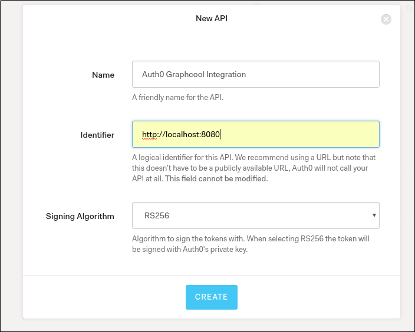

# auth0-authentication

Add Auth0 Authentication to your Graphcool project 🎁


## Getting Started

### 1. Add the template to your Graphcool service

```sh
graphcool add-template graphcool/templates/auth/auth0
```

### 2. Uncomment lines in `graphcool.yml` and `types.graphql`

The [`add-template`](https://docs-next.graph.cool/reference/graphcool-cli/commands-aiteerae6l#graphcool-add-template) command is performing three major steps:

1. Download the source files from the [`src`](./src) directory and put them into your service's `src` directory (into a subdirectory called `auth0`).
2. Download the contents from [`graphcool.yml`](./graphcool.yml) and append them as comments to your service's `graphcool.yml`.
3. Download the contents from [`types.graphql`](./types.graphql) and append them as comments to your service's `types.graphql`.

In order for the changes to take effect, you need to manually uncomment all the lines that have been added by the `add-template` command.

### 3. Setup Auth0

#### 3.1 Create an API

* Create a new Auth0 account or log-in to your existing one
* Create a new API. Select `RS256` as the signing algorithm. Keep the Identifier value handy as we will use it later on.



#### 3.2 Create a Client

* Create a new Auth0 client with the following settings


  * Client Type - *Regular Web Application*
  * Token Endpoint Authentication Method - *Post*
  * Allowed Callback URLs - `http://localhost:8080/`
  


  * In Advanced Settings Section - OAuth tab set JWT Signature Algorithm to value *RS256* and turn on the OIDC Conformant swith.


  
  * In Advanced Settings Section - Grant Types tab only leave the *Implicit* grant type enabled.


### 4. Deploy the service

*Make sure the `AUTH0_DOMAIN` and `AUTH0_AUDIENCE` environment variables are properly set before running the command below. The `AUTH0_AUDIENCE` should match the identifier set in 3.1 Create an API*

Finally, you need to install the [node dependencies](./package.json#L2) and apply all the changes you just made by deploying the service:

```sh
npm install
graphcool deploy
```

## Test the Code

### Setting up the example app

* In order to setup Auth0 Lock Widget replace `__AUTH0_DOMAIN__`, `__AUTH0_CLIENT_ID__` and `__AUTH0_AUDIENCE__`in `example/index.js` with the credentials from your API/Client settings.
* Serve the test application locally on port 8080. For example :

```bash
npm i -g http-server
cd example
http-server
```
* Open `http://localhost:8080/` in a browser and authenticate with the Auth0 Widget.
* Copy the mutation displayed on the page.

### Testing the authentication function

Go to the Graphcool Playground:

```sh
graphcool playground
```

Paste the mutation copied from above

You should see that a new user has been created. The returned token can be used to authenticate requests to your Graphcool API as that user. Note that running the mutation again with a new Auth0 token for the same user will not add a new user.


### FAQ

#### My `access_token` is not a valid jwt

To have a jwt access_token you need to have (client side):

- a correct `audience` set (you can find the correct API audience on https://manage.auth0.com/#/apis)
- `responseType` should include `token`
- `scope` should include `openid`

Note: The easy way to know if your `access_token` is a jwt, is to try to decode it on https://jwt.io/

#### Can I use other auth0 clients? (native, spa, non interactive clients)

Of course! Just be sure to have a correct `access_token` as auth0 response :wink:

#### How can I retrieve user data from auth0

You have a lot of user data available in auth0 (depends on which provider you choose).

First of all, you need to set your scope as `openid email profile`.

With `profile` in the scope, you will receive a lot more data (cf https://auth0.com/docs/user-profile/normalized/auth0)

For example, I want to add `picture` and `nickname` to User node.

1. Add `picture` and `nickname` to User type

```diff
diff --git a/auth/auth0/types.graphql b/auth/auth0/types.graphql
index 6e747cb..39854b3 100644
--- a/auth/auth0/types.graphql
+++ b/auth/auth0/types.graphql
@@ -7,5 +7,7 @@ type User @model {
   updatedAt: DateTime! # read-only (managed by Graphcool)
 
   email: String
+  picture: String
+  nickname: String
   auth0UserId: String @isUnique
 }
```

2. Add auth0 user data to `createUser` mutation

```diff
diff --git a/auth/auth0/src/auth0Authentication.ts b/auth/auth0/src/auth0Authentication.ts
index cc3b123..d4c6e5c 100644
--- a/auth/auth0/src/auth0Authentication.ts
+++ b/auth/auth0/src/auth0Authentication.ts
@@ -115,12 +115,19 @@ async function createGraphcoolUser(api: GraphQLClient, auth0User: Auth0User): Pr
       mutation createUser($auth0UserId: String!, $email: String) {
         createUser(
           auth0UserId: $auth0UserId,
-          email: $email
+          email: $email,
+          picture: $picture,
+          nickname: $nickname
         ){
           id
         }
       }
     `,
-    { auth0UserId: auth0User.sub, email: auth0User.email }
+    {
+      auth0UserId: auth0User.sub,
+      email: auth0User.email,
+      picture: auth0User.picture,
+      nickname: auth0User.nickname
+     }
     ).then(res => res.createUser.id)
 }

```

3. That's it! Now you have `nickname` and `picture` in your graphcool User data.