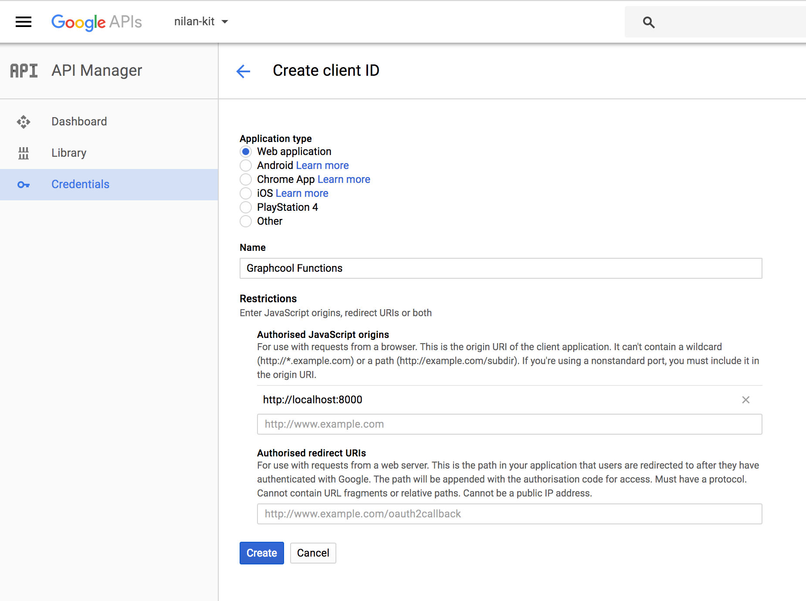
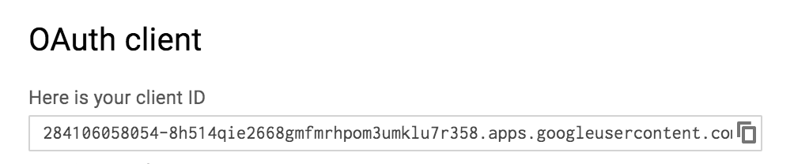

# google-authentication

Create Google users and sign in with Schema Extensions and Graphcool Functions ⚡️

> Note: Schema Extensions are currently only available in the Beta Program.

## Getting Started

```sh
npm -g install graphcool
graphcool init --schema google-authentication.graphql
```

## Authentication flow in app

1. The user clicks `Authenticate with Google` button
2. The Google UI is loaded and the user accepts to authenticate
3. Your app receives a Google Access Token
4. Your app calls the Graphcool mutation `authenticateGoogleUser(googleToken: String!)`
5. If no user exists yet that corresponds to the passed `googleToken`, a new `User` node will be created
6. In any case, the `authenticateFacebookUser(facebookToken: String!)` mutation returns a valid token for the user
7. Your app stores the token and uses it in its `Authorization` header for all further requests to Graphcool

## Setup the Authentication Function

* Create a new Schema Extension Function and paste the schema from `schema-extension.graphql` and code from `google-authentication.js`.
* Create a new Permanent Access Token (PAT) in project settings. *It needs to have the same name as the function to make it available in the execution context of the function.*
* Remove all Create permissions from the `User` type. The function uses a Permanent Access Token to create users via the API so the permissions are not needed.

## Google App Setup

Follow the steps on https://developers.google.com/identity/ for how to work with the Google Identity Platform.
* First, create a new project:

  

* Click the `Credentials` tab to create new credentials. Choose `OAuth client ID`:

  

* Choose `Webapplication` as application type, and add `http://localhost:8000` as authorised JavaScript origin:

  

* Create a new Client ID

  


Copy the Client ID and use it to replace `__CLIENT_ID__` in `login.html`.

To create a test Google Token, run `login.html`, for example using Python's `SimpleHTTPServer`:

```sh
python -m SimpleHTTPServer
```

Open `http://localhost:8000/login.html` in your browser and use the login button to create a new Google Token. It will be printed in the DevTools.

## Test the Code

First, obtain a valid Google token with the small app in `login.html` as mentioned above.

Go to the Graphcool Playground:

```sh
graphcool playground
```

Run this mutation to authenticate a user:

```graphql
mutation {
  # replace __GOOGLE_TOKEN__!
  authenticateGoogleUser(googleToken: "__GOOGLE_TOKEN__") {
    token
  }
}
```

You should see that a new user has been created. The returned token can be used to authenticate requests to your Graphcool API as that user. Note that running the mutation again with the same Facebook token will not add a new user.
